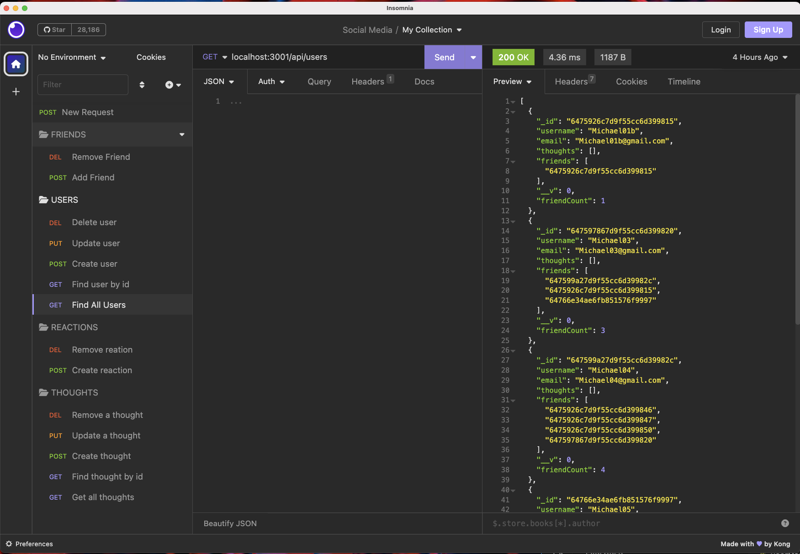
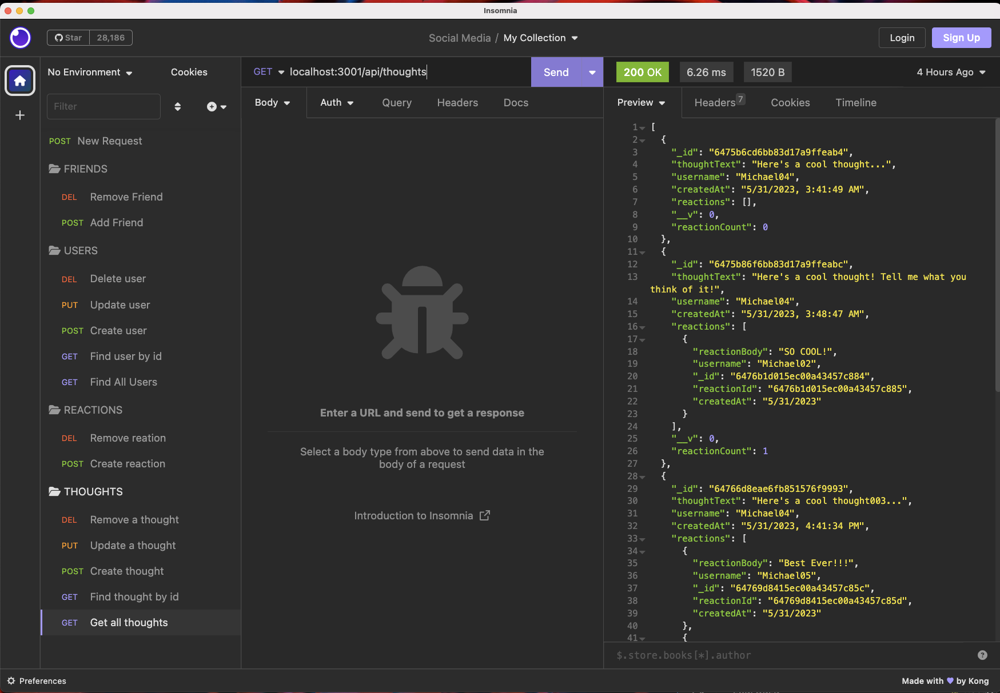

# Social-Network-API-NoSQL

## Description
This project is an API for a Social Network Web Application where users can share their thoughts, react to friends thoughts, and create a friend list. It utilizes Express.js for routing, a MongoDB database, and the Mongoose ODM.

## Table of Contents
* [Description](#description)
* [Installation](#installation)
* [Usage](#usage)

* [License](#license)

* [Contributing](#contributing)
* [Testing](#testing)
* [Questions](#questions)


## Installation

To install and run the application, follow these steps:

1.	Clone this repository or download its source code as a ZIP file and extract it to a directory on your computer.
2.	Open a terminal or command prompt and navigate to the directory where you extracted the source code with  an editor like vs Code.
3.	Run the command npm install to install the required dependencies.
4.  Then type npm run start in the terminal 


## Usage
```

After you start the application, you can use Insominia to navigate to the folowing routes.

API Routes
The following routes are available in the API:

GET /api/users: Get all users

GET /api/users/:userId: Get a single user by ID

POST /api/users: Create a new user

PUT /api/users/:userId: Update a user by ID

DELETE /api/users/:userId: Delete a user by ID

GET /api/thoughts: Get all thoughts

GET /api/thoughts/:thoughtId: Get a single thought by ID

POST /api/thoughts: Create a new thought

PUT /api/thoughts/:thoughtId: Update a thought by ID

DELETE /api/thoughts/:thoughtId: Delete a thought by ID

POST /api/thoughts/:thoughtId/reactions: Add a reaction to a thought

DELETE /api/thoughts/:thoughtId/reactions/:reactionId: Remove a reaction from a thought

POST /api/users/:userId/friends/:friendId: Add a friend to a user's friend list

DELETE /api/users/:userId/friends/:friendId: Remove a friend from a user's friend list
```
## License
        Licensed under the MIT license.
       
## Contributing
If you would like to contribute to this repository, please feel free to discuss the change you wish to make via Email, or GitHub with me before making a change.
## Testing

NA


## Walkthrough Video Link
https://watch.screencastify.com/v/qnXAdvwas2S8SWRHpTeR

## Screenshot




## Questions
* Github - [m-s-muniz](https://github.com/m-s-muniz/)
* Email - someone@somewhere.com